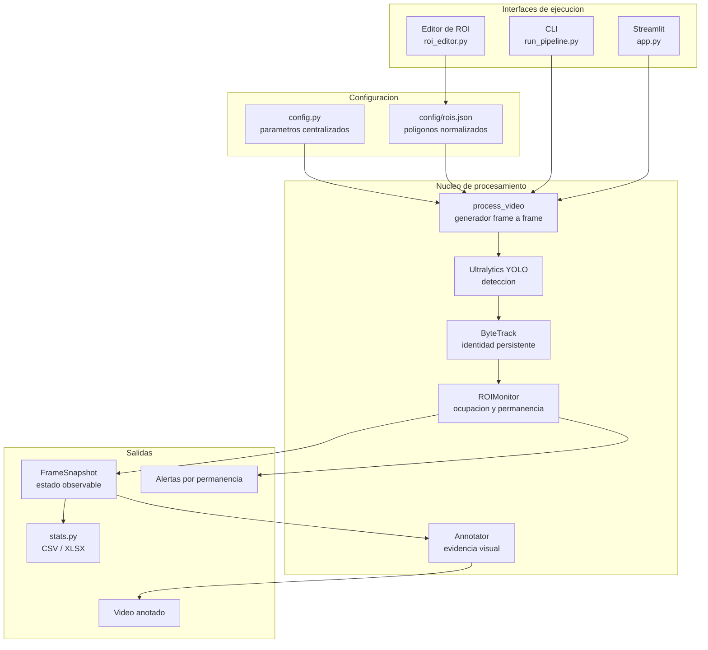
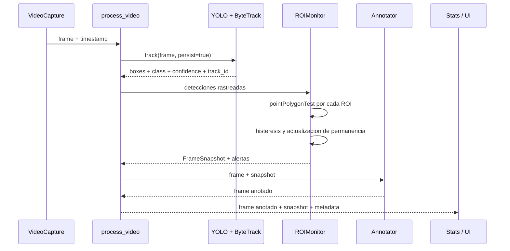
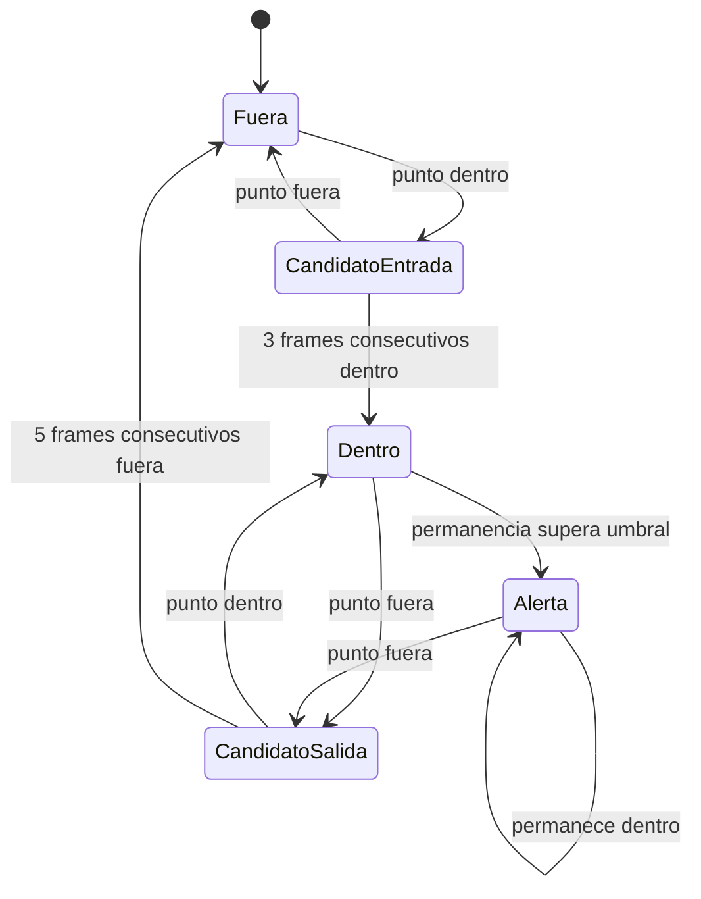

# Monitoreo de vehiculos en regiones de interes

Sistema de vision por computador que detecta vehiculos con YOLO, mantiene sus
identidades mediante ByteTrack y mide su ingreso y permanencia en multiples
regiones de interes (ROI) sobre un video cenital de un estacionamiento.

## Funcionalidades

- deteccion de vehiculos con modelos de Ultralytics YOLO;
- seguimiento multiobjeto con ByteTrack;
- regiones poligonales en coordenadas normalizadas;
- conteo de objetos unicos, visitas y ocupacion simultanea;
- medicion de permanencia con histeresis temporal;
- alertas configurables por ROI;
- exportacion de estadisticas a CSV y Excel;
- ejecucion por CLI e interfaz interactiva con Streamlit.

## Arquitectura

### Vista de componentes



El CLI y la aplicacion Streamlit utilizan el mismo generador
`roi_tracker.process_video`, por lo que comparten la logica de procesamiento.

### Flujo por frame



### Maquina de estados por objeto y ROI

Cada par `(track_id, roi_id)` mantiene su propio `ROIState`. La histeresis
evita contabilizar multiples visitas cuando una caja oscila sobre el borde del
poligono.



Al confirmar una entrada se acreditan retroactivamente los frames candidatos;
al confirmar una salida se descuentan los frames ya observados fuera. Esta
compensacion evita que la histeresis sesgue el tiempo de permanencia.

### Responsabilidades por modulo

| Modulo | Responsabilidad |
|---|---|
| `config.py` | Rutas, parametros de inferencia, clases COCO y definicion de ROI |
| `roi_tracker.py` | Deteccion, tracking, maquina de estados, alertas y anotacion |
| `run_pipeline.py` | Orquestacion por linea de comandos y exportacion final |
| `app.py` | Interfaz Streamlit sobre el mismo pipeline compartido |
| `roi_editor.py` | Creacion y verificacion visual de poligonos normalizados |
| `stats.py` | Agregacion y exportacion de metricas a CSV/XLSX |
| `test_roi_logic.py` | Pruebas deterministas de pertenencia e histeresis |

## Estructura

```text
.
|-- config/rois.json
|-- informe/INFORME_TECNICO.md
|-- outputs/
|   |-- resumen_global.csv
|   |-- resumen_por_roi.csv
|   |-- permanencia_por_objeto.csv
|   |-- objetos.csv
|   `-- *.jpg
|-- src/
|   |-- app.py
|   |-- config.py
|   |-- detect_track.py
|   |-- roi_editor.py
|   |-- roi_tracker.py
|   |-- run_pipeline.py
|   |-- stats.py
|   `-- test_roi_logic.py
|-- videos/
|   |-- input/
|   `-- output/
|-- Informe_Tecnico_HW2.pdf
`-- requirements.txt
```

Los pesos `.pt` y los videos `.mp4` se conservan localmente, pero se excluyen de
Git por su tamano y porque la procedencia del video debe documentarse antes de
redistribuirlo.

## Resultados de la ejecucion incluida

| Metrica | Valor |
|---|---:|
| Frames procesados | 864 |
| Vehiculos detectados (`track_id` unicos) | 283 |
| Vehiculos que ingresaron en alguna ROI | 80 |
| Visitas totales | 168 |
| Permanencia media global | 1.93 s |
| FPS de procesamiento | 2.39 |
| Alertas emitidas | 0 |

Resultados por region:

| ROI | Objetos unicos | Visitas | Ocupacion maxima |
|---|---:|---:|---:|
| Pasillo norte | 27 | 30 | 3 |
| Bahias centrales | 60 | 135 | 8 |
| Pasillo sur | 3 | 3 | 1 |

Estas cifras corresponden a los CSV incluidos en `outputs/`. Un `track_id` no
equivale necesariamente a un vehiculo fisico: una oclusion puede fragmentar una
trayectoria. Ademas, 2.39 FPS no constituye procesamiento en tiempo real para un
video de 29.97 FPS.

## Instalacion

```bash
python -m venv .venv
```

En Windows:

```powershell
.venv\Scripts\Activate.ps1
pip install -r requirements.txt
```

En Linux o macOS:

```bash
source .venv/bin/activate
pip install -r requirements.txt
```

Por defecto el proyecto solicita `yolo26m.pt`. Si los pesos no estan disponibles,
Ultralytics intentara descargarlos durante la primera ejecucion.

## Uso

Verificar o editar las regiones de interes:

```bash
python src/roi_editor.py --preview --rejilla
python src/roi_editor.py
```

Procesar el video:

```bash
python src/run_pipeline.py
python src/run_pipeline.py --max-frames 150
python src/run_pipeline.py --clases 2 5 7 --conf 0.4 --imgsz 1280
```

Abrir la interfaz:

```bash
streamlit run src/app.py
```

Ejecutar las pruebas de la logica ROI, sin modelo ni GPU:

```bash
python src/test_roi_logic.py
```

## Evidencia

- `outputs/roi_preview.jpg`: vista previa de las ROI.
- `outputs/resumen_global.csv`: metricas generales.
- `outputs/resumen_por_roi.csv`: metricas desglosadas por region.
- `outputs/permanencia_por_objeto.csv`: permanencia por trayectoria.
- `Informe_Tecnico_HW2.pdf`: informe de la entrega.

## Limitaciones

- Falta completar en el informe la procedencia y licencia del video.
- El conteo requiere validacion manual para estimar falsos positivos, falsos
  negativos y cambios de identidad.
- El modelo es preentrenado sobre COCO y no fue ajustado especificamente a esta
  escena.
- La ejecucion documentada no alcanza la velocidad del video original.
